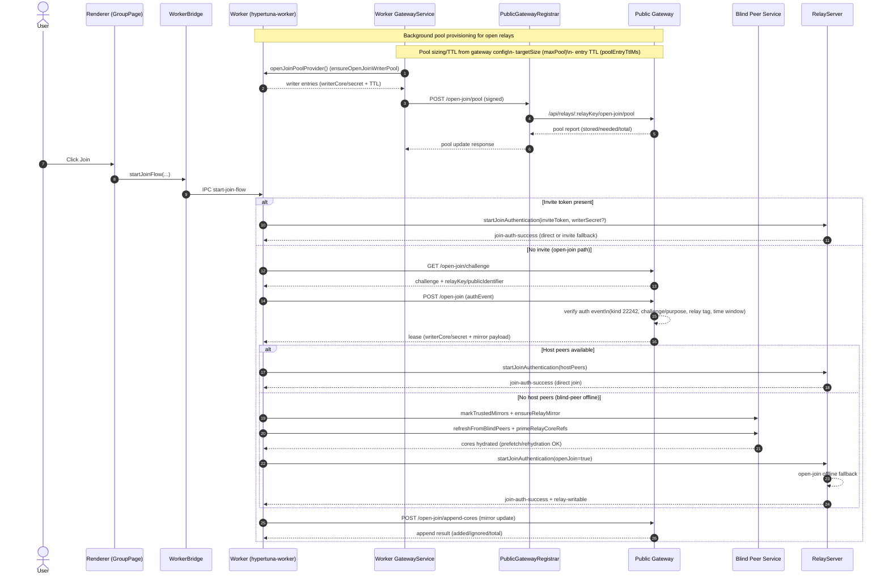

# Open-Join Architecture & End-to-End Flow (Hypertuna)

This document maps the open-join flow (no invite, host offline) to the code and the test logs:
- Worker log: `test-logs/OPEN-JOIN-WORKFLOW/test7-PASS-open-join-refactor-CHECKPOINT/worker.log`
- Public gateway log: `test-logs/OPEN-JOIN-WORKFLOW/test7-PASS-open-join-refactor-CHECKPOINT/public-gateway.log`

Observed identifiers from the logs (2026-01-30 UTC):
- Group (publicIdentifier): `npub1qetglwnnwujyqzadqc84f5fx8r8hkcyz8cqyegywh3hc8xgvcy3q29uy7y:drShits`
- Relay key: `543cdb0b4c89dea5ee6c2b7cf1731503b4b90f0fb35cd1671c09d0c330fecfb9`
- Writer core prefix: `gu4pnqupyobyck9d...`
- Writer core hex prefix: `34f4d13a6d040206...`
- Blind peer key prefix: `x597qroj14ith1y8...`

## System Components (with code references)

Renderer (Electron UI):
- **Group join UI**: `hypertuna-desktop/src/pages/secondary/GroupPage/index.tsx:736` (invokes `startJoinFlow` with open-join flags).
- **Worker bridge**: `hypertuna-desktop/src/providers/WorkerBridgeProvider.tsx:540` (packages join payload, discovers host peers, IPC to worker).
- **Group creation / metadata**: `hypertuna-desktop/src/providers/GroupsProvider.tsx:1028` and `hypertuna-desktop/src/providers/GroupsProvider.tsx:1696` (creates hosted relay and publishes metadata including `open/closed`).

Worker (local worker process):
- **Open-join pool provisioning**: `hypertuna-worker/index.js:776` (`ensureOpenJoinWriterPool`).
- **Open-join bootstrap (challenge + lease)**: `hypertuna-worker/index.js:1409` (`fetchOpenJoinBootstrap`).
- **Open-join append cores (mirror update)**: `hypertuna-worker/index.js:1209` and `hypertuna-worker/index.js:1376`.
- **Join flow orchestrator**: `hypertuna-worker/index.js:3900` (`start-join-flow` handler).
- **Blind-peering hydration**: `hypertuna-worker/index.js:4081` (mirror refresh + prefetch), `hypertuna-worker/blind-peering-manager.mjs:320` and `hypertuna-worker/blind-peering-manager.mjs:680`.
- **Join authentication and offline fallback**: `hypertuna-worker/pear-relay-server.mjs:3340` (startJoinAuthentication), `hypertuna-worker/pear-relay-server.mjs:3750` (open-join offline path).
- **Writer material / expectations**: `hypertuna-worker/hypertuna-relay-manager-adapter.mjs:1178` (writer key derivation, join expectations).

Gateway sync layer (worker -> public gateway):
- **Gateway service (pool sync)**: `hypertuna-worker/gateway/GatewayService.mjs:1872` (`#syncOpenJoinPool`).
- **Public gateway registrar**: `hypertuna-worker/gateway/PublicGatewayRegistrar.mjs:103` (pushes pool updates to gateway).
- **Gateway service wiring**: `hypertuna-worker/index.js:2037` (injects `openJoinPoolProvider`).

Public gateway service:
- **Open-join endpoints**: `public-gateway/src/PublicGatewayService.mjs:3912` (challenge), `:3968` (lease), `:4102` (append cores).
- **Open-join pool update**: `public-gateway/src/PublicGatewayService.mjs:3658`.
- **Mirror payloads**: `public-gateway/src/PublicGatewayService.mjs:796`.
- **Blind peer service**: `public-gateway/src/blind-peer/BlindPeerService.mjs:209` (trusted peers), `:560` (metadata snapshot load).
- **Hyperswarm pool / discovery**: `shared/public-gateway/HyperswarmClient.mjs:441`, `public-gateway/src/discovery/GatewayAdvertiser.mjs:40`.

## End-to-End Flow (open-join, no invite, host offline)

## Sequence Diagram (Invite vs No-Invite, with Pool Provisioning)

## Config knobs (public gateway)

From `public-gateway/src/config.mjs`:

- `GATEWAY_OPEN_JOIN_ENABLED` (default: enabled unless set to `false`)
- `GATEWAY_OPEN_JOIN_POOL_TTL_MS` (default: `6 * 60 * 60 * 1000` = 6 hours)
- `GATEWAY_OPEN_JOIN_CHALLENGE_TTL_MS` (default: `2 * 60 * 1000` = 2 minutes)
- `GATEWAY_OPEN_JOIN_AUTH_WINDOW` (default: `300` seconds)
- `GATEWAY_OPEN_JOIN_MAX_POOL` (default: `100`)
- `GATEWAY_OPEN_JOIN_POOL_TTL` (default: `21600` seconds; pool record TTL in registration store)
- `GATEWAY_MIRROR_METADATA_TTL` (default: `86400` seconds; mirror metadata TTL)

### 0) Create group and hosted relay
- UI calls `createRelay` to spin up a hosted relay with `isOpen` and `fileSharing` flags.
  - Renderer: `GroupsProvider.createHypertunaRelayGroup` calls `createRelay` (`hypertuna-desktop/src/providers/GroupsProvider.tsx:1028`).
  - Worker IPC: `create-relay` message handled in `hypertuna-worker/index.js:3753`.
  - Relay server: `pear-relay-server.createRelay` logs creation and registers with gateway (`hypertuna-worker/pear-relay-server.mjs:3151`).

### 1) Open-join pool provisioning (writer leases)
- Gateway service watches hosted relay metadata and calls the pool provider for open relays.
  - `GatewayService.#syncOpenJoinPool` (worker) evaluates `isOpen/isHosted` and requests entries from `openJoinPoolProvider` (`hypertuna-worker/gateway/GatewayService.mjs:1872`).
  - Pool provider is `ensureOpenJoinWriterPool` in worker (`hypertuna-worker/index.js:776`) and is wired via `startGatewayService` (`hypertuna-worker/index.js:2037`).
  - Pool updates are sent to the public gateway registrar (`hypertuna-worker/gateway/PublicGatewayRegistrar.mjs:103`).
- Public gateway accepts signed pool updates and stores entries + metadata.
  - `PublicGatewayService.#handleOpenJoinPoolUpdate` (`public-gateway/src/PublicGatewayService.mjs:3658`).
  - Pool entry TTL and max sizes come from `public-gateway/src/config.mjs:21` and `:81`.

### 2) Mirror core addition (open-join append) + blind-peer availability
- After writer sync or join, the relay adapter schedules open-join core appends.
  - `hypertuna-relay-manager-adapter.mjs:1610` calls `appendOpenJoinMirrorCores` for open relays.
  - Worker posts to `/open-join/append-cores` via `submitOpenJoinAppendCores` (`hypertuna-worker/index.js:1209`).
- Public gateway validates the append auth event and merges core refs.
  - `PublicGatewayService.#handleOpenJoinAppendCores` (`public-gateway/src/PublicGatewayService.mjs:4102`).
  - Mirror payload is persisted for joiners (`public-gateway/src/PublicGatewayService.mjs:796`).
- Blind peer service loads and tracks mirror metadata and trusted peers.
  - `BlindPeerService` metadata snapshot + trusted peers (`public-gateway/src/blind-peer/BlindPeerService.mjs:560`, `:1502`).

### 3) Join request (renderer -> worker)
- GroupPage triggers worker join flow, passing `openJoin: true` and no invite material.
  - `GroupPage.handleJoin` (`hypertuna-desktop/src/pages/secondary/GroupPage/index.tsx:736`).
  - WorkerBridge packages join payload, attempts host peer lookup, and IPCs `start-join-flow` (`hypertuna-desktop/src/providers/WorkerBridgeProvider.tsx:540`).

Log evidence:
- Worker log shows `start-join-flow` with `openJoin: true`, no writer core/secret, and no host peers (`worker.log:2399-2422`).

### 4) Open-join bootstrap (challenge -> lease)
- Worker fetches a challenge, signs a Nostr auth event, and posts to `/open-join`.
  - `fetchOpenJoinBootstrap` (`hypertuna-worker/index.js:1409`).
- Public gateway issues the challenge, verifies the auth event, and leases a writer from the pool.
  - Challenge: `PublicGatewayService.#handleOpenJoinChallenge` (`public-gateway/src/PublicGatewayService.mjs:3912`).
  - Lease: `PublicGatewayService.#handleOpenJoinRequest` (`public-gateway/src/PublicGatewayService.mjs:3968`).
  - Auth verification: `PublicGatewayService.#verifyOpenJoinAuthEvent` (`public-gateway/src/PublicGatewayService.mjs:968`).

Log evidence:
- Gateway: `Open join challenge issued` and `Open join lease issued` (`public-gateway.log:87-88`).
- Worker: `Open join challenge ok`, `Open join auth event signed`, `Open join bootstrap response` (`worker.log:2425-2455`).

### 5) Blind-peer mirror hydration (joiner)
- Worker uses blind-peer metadata to hydrate local cores before joining:
  - `start-join-flow` fallback path (`hypertuna-worker/index.js:4081`).
  - `BlindPeeringManager.ensureRelayMirror` and `primeRelayCoreRefs` (`hypertuna-worker/blind-peering-manager.mjs:320`, `:376`).
  - `BlindPeeringManager` rehydration cycle (`hypertuna-worker/blind-peering-manager.mjs:680`).

Log evidence:
- Worker logs `Blind-peer join flow: using relay corestore`, `refreshing mirrors`, `core prefetch complete`, `rehydration completed` (`worker.log:2476-2547`).

### 6) Join authentication + open-join offline path
- Worker calls `relayServer.startJoinAuthentication` with writer secret and core refs.
  - `hypertuna-worker/index.js:4172` -> `pear-relay-server.startJoinAuthentication` (`hypertuna-worker/pear-relay-server.mjs:3340`).
- With no host peers and open-join enabled, the relay server uses the open-join offline path:
  - `pear-relay-server.mjs:3750` creates a provisional token, pre-seeds join metadata, joins locally, waits for writer activation, and emits join success (`relay-writable`, `join-auth-success`).

Log evidence:
- Worker log shows `startJoinAuthentication payload` and `Falling back to open join offline path` (`worker.log:2563-2598`).

### 7) Merge/sync writer core state + mirror append after join
- Writer material is validated and merged into local relay profile:
  - `hypertuna-relay-manager-adapter.mjs:1178` (writer expectations, secret inspection).
- After join, if writers were added, relay adapter schedules open-join mirror append to keep the gateway pool fresh:
  - `hypertuna-relay-manager-adapter.mjs:1610`.

## Log-to-Code Trace (test7-PASS-open-join-refactor-CHECKPOINT)

Public gateway log (2026-01-30T21:11:14Z):
- Challenge issued: `public-gateway.log:87` -> `PublicGatewayService.#handleOpenJoinChallenge` (`public-gateway/src/PublicGatewayService.mjs:3912`).
- Lease issued: `public-gateway.log:88` -> `PublicGatewayService.#handleOpenJoinRequest` (`public-gateway/src/PublicGatewayService.mjs:3968`).
- Core append: `public-gateway.log:100-101` -> `PublicGatewayService.#handleOpenJoinAppendCores` (`public-gateway/src/PublicGatewayService.mjs:4102`).

Worker log (2026-01-30T21:11:14-15Z):
- Join flow start: `worker.log:2399` -> `GroupPage.handleJoin` (`hypertuna-desktop/src/pages/secondary/GroupPage/index.tsx:736`) and `WorkerBridgeProvider.startJoinFlow` (`hypertuna-desktop/src/providers/WorkerBridgeProvider.tsx:540`).
- Open-join bootstrap: `worker.log:2425-2455` -> `fetchOpenJoinBootstrap` (`hypertuna-worker/index.js:1409`).
- Blind-peer hydration: `worker.log:2476-2547` -> `start-join-flow` blind-peer fallback (`hypertuna-worker/index.js:4081`) and `BlindPeeringManager` (`hypertuna-worker/blind-peering-manager.mjs:320`, `:680`).
- Open-join offline join: `worker.log:2563-2598` -> `startJoinAuthentication` (`hypertuna-worker/pear-relay-server.mjs:3340`, `:3750`).

## Notes / Observations
- The joiner had **no host peers**, so it relied on blind-peer mirror hydration and the open-join offline path.
- The public gateway lease was issued from the **open-join pool** (source: `pool` in logs), confirming pool provisioning was active.
- Core append happened immediately after lease in the gateway log, consistent with the worker append flow used to keep mirror metadata fresh.
